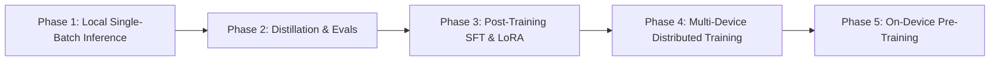

# Full-Stack On-Device AI Roadmap: From Inference to Pre-Training

The long-term vision of `clj-einsum` is to provide a unified, pure Clojure numerical infrastructure powered by OpenXLA that spans the **entire Machine Learning lifecycle** on consumer hardware (laptops, desktops, workstations with Intel SYCL, AMD ROCm, NVIDIA CUDA, Apple Metal).

## Notation

This document uses the following conventions throughout:

- `B` — batch size: a count of requests or examples, e.g. `B=1` single-request inference.
- Model scale is always written with `-param`, e.g. `8B-param`, `300M-param`. A bare `B` never means "billion" here.
- `N` — sequence length; `d` — model width; `r` — LoRA rank.
- VRAM means GPU memory; RAM means host memory.

Underneath every phase is the same representation: Tensor Logic as the language for the tensor-computable slice (contractions, attention, elementwise nonlinearities, autodiff closure), compiled to StableHLO. See `VISION.md` for what that representation covers and what it deliberately does not. The phases below are ML workloads, not new representations.

---

## 🗺️ The 5-Phase Full-Stack Roadmap

---

### Phase 1: Local Single-Batch Inference (Current Focus)
* **Goal**: Minimize single-request (`B=1`) latency on consumer hardware via zero-copy unified memory, in-graph quantization, and speculative decoding.
* **Key Components**:
  - Pedro Domingos' Declarative Tensor Logic (`einsum.logic.*`) as the tensor-equation representation.
  - Native Panama PJRT C API bindings (`einsum.compiler.pjrt`).
  - SOTA benchmark suite (`tools/benchmark.clj`).
  - Autoregressive model definitions: Gemma 4, Gemma 3, Gemma 2, GPT-2, SmolLM.

---

### Phase 2: Distillation & Automated Evaluation Framework
* **Goal**: Build pure Clojure evaluation suites and model distillation utilities for consumer devices.
* **Key Additions**:
  - Task evaluation harness (MMLU, GSM8K, HumanEval, SWE-bench mini).
  - Logit distillation loss pipeline (`einsum.logic.nn`) to train small draft assistant models (e.g. 15MB EAGLE heads or 300M-param draft models).

---

### Phase 3: Post-Training (SFT, LoRA, DPO)
* **Goal**: Enable fine-tuning of 1B-param – 12B-param models on single consumer GPUs (16–24 GB VRAM).
* **Key Additions**:
  - Reverse-mode Automatic Differentiation (VJP / Reverse AD in `einsum.compiler.autodiff`).
  - Low-Rank Adaptation (LoRA) layers: `W + BA` with rank `r`.
  - AdamW optimizer in StableHLO MLIR (`einsum.runtime.opt`).

---

### Phase 4: Multi-Device Distributed Parallelism
* **Goal**: Scale training and inference across local multi-GPU desktops and heterogeneous laptop clusters.
* **Key Additions**:
  - OpenXLA `ReplicaGroup` and collective communication (`AllReduce`, `AllGather`, `ReduceScatter`).
  - Tensor Parallelism (TP) and Pipeline Parallelism (PP).

---

### Phase 5: On-Device Pre-Training Infrastructure
* **Goal**: Pre-train specialized small-to-medium models (100M-param – 3B-param) from scratch on consumer hardware using pure OpenXLA pipeline compilation.
* **Scope note**: the infrastructure targets the *mechanics* of pre-training at consumer scale using pure StableHLO pipelines.
