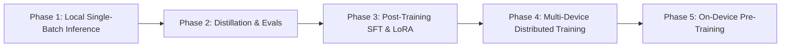

# Full-Stack On-Device AI Roadmap: From Inference to Pre-Training

The long-term vision of `clj-xla` is to provide a unified, pure Clojure numerical infrastructure powered by OpenXLA that spans the **entire Machine Learning lifecycle** on consumer hardware (laptops, desktops, workstations with Intel SYCL, AMD ROCm, NVIDIA CUDA, Apple Metal).

## Notation

This document uses the following conventions throughout:

- `B` — batch size: a count of requests or examples, e.g. `B=1` single-request inference.
- Model scale is always written with `-param`, e.g. `8B-param`, `300M-param`. A bare `B` never means "billion" here.
- `N` — sequence length; `d` — model width; `r` — LoRA rank.
- VRAM means GPU memory; RAM means host memory.

Underneath every phase is the same representation: Tensor Logic as the language for the tensor-computable slice (contractions, attention, elementwise nonlinearities, autodiff closure), compiled to StableHLO. See `VISION.md` for what that representation covers and what it deliberately does not. The phases below are ML workloads, not new representations.

---

## 🗺️ The 5-Phase Full-Stack Roadmap

---

### Phase 1: Local Single-Batch Inference (Current Focus)
* **Goal**: Minimize single-request (`B=1`) latency on consumer hardware via zero-copy unified memory, in-graph quantization, and speculative decoding.
* **Key Components**:
  - Pedro Domingos' Declarative Tensor Logic (`clj-xla.logic.*`) as the tensor-equation representation.
  - Native Panama PJRT C API bindings (`clj-xla.pjrt`).
  - SOTA benchmark suite (`scripts/benchmark.clj`).
  - Autoregressive model definitions: Gemma 4, GPT-2, SmolLM, Muse-Glimmer.
  - **Gemma 4 26B A4B (MoE)**: mixture-of-experts backbone — 26B total params, ~4B active per token (128 experts, 8 active + 1 shared). Needs MoE top-k routing (top-k + gather over expert FFNs) in the model definitions; each expert FFN is itself a standard contraction.
  - **Diffusion language models** (DiffusionGemma-style): a bidirectional denoiser compiled in-graph plus a host-side canvas sampler, built on the MoE backbone above. Diffusion decoding is a reduce — `canvas_{t+1} = denoise(canvas_t, t)` — the same loop-is-a-reduce pattern as the agent loop. This serves the `B=1` latency goal directly: diffusion shifts single-user decode from memory-bound to compute-bound. Needs: bidirectional attention (causal mask off), encoder-decoder cross-attention.
  - **Tabular foundation models** (TabFM-style): alternating row/column attention over a `(rows × cols × d)` table, row compression to dense vectors, and an ICL transformer over the compressed rows. Pure attention plus contraction — no new ops; attention over permuted axes is reshape plus the existing attention lowering. Tables are padded to bounded maxima (TabFM defaults: 100 rows, 500 features), so one compiled program covers all inputs. Heterogeneous feature encoding (ordinal encoders, scalers) stays host-side preprocessing.

---

### Phase 2: Distillation & Automated Evaluation Framework
* **Goal**: Build pure Clojure evaluation suites and model distillation utilities for consumer devices.
* **Key Additions**:
  - Task evaluation harness (MMLU, GSM8K, HumanEval, SWE-bench mini; tabular: TabArena-style Elo).
  - Logit distillation loss pipeline (`clj-xla.logic.nn`) to train small draft assistant models (e.g. 15MB EAGLE heads or 300M-param draft models).
  - **Sampler distillation** for diffusion models: few-step student from a many-step teacher, following the DiffusionGemma training recipe.

---

### Phase 3: Post-Training (SFT, LoRA, DPO)
* **Goal**: Enable fine-tuning of 8B-param – 30B-param models on single consumer GPUs (24–32 GB VRAM).
* **Key Additions**:
  - Reverse-mode Automatic Differentiation (VJP / Reverse AD in `clj-xla.autodiff`).
  - Low-Rank Adaptation (LoRA) layers: `W + BA` with rank `r`.
  - AdamW optimizer in StableHLO MLIR (`clj-xla.opt`).
  - **Diffusion post-training**: bidirectional-denoising SFT objectives compile through the same autodiff closure as AR post-training.

---

### Phase 4: Multi-Device Distributed Parallelism
* **Goal**: Scale training and inference across local multi-GPU desktops and heterogeneous laptop clusters.
* **Key Additions**:
  - OpenXLA `ReplicaGroup` and collective communication (`AllReduce`, `AllGather`, `ReduceScatter`).
  - Tensor Parallelism (TP) and Pipeline Parallelism (PP).

---

### Phase 5: On-Device Pre-Training Infrastructure
* **Goal**: Pre-train specialized small-to-medium models (100M-param – 3B-param) from scratch on consumer hardware using pure OpenXLA pipeline compilation.
* **Scope note**: the infrastructure targets the *mechanics* of pre-training at consumer scale. Google-scale synthetic-data regimes (e.g. TabFM's hundreds of millions of SCM-generated tables) remain out of scope as a training workload; running and distilling such models is Phases 1–2.
