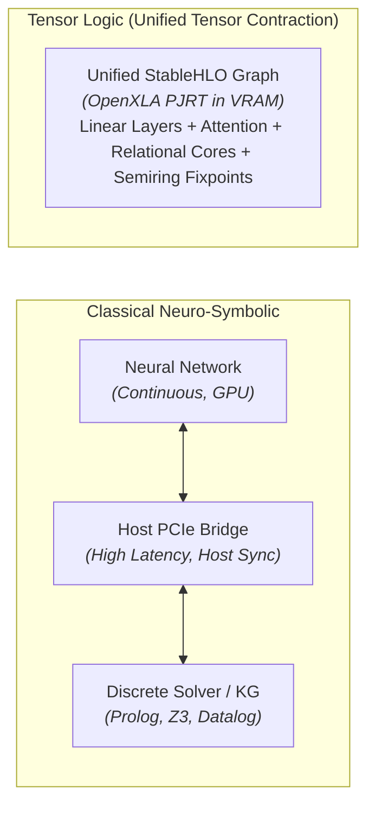

# Related Work & Comparative Analysis

This document situates the **Declarative Tensor Logic & In-Tensor Relational Memory** engine of `clj-xla` within the broader landscape of neuro-symbolic AI, tensor-based reasoning, associative memory architectures, and compiled domain-specific languages.

---

## 🧭 The Neuro-Symbolic Landscape

Modern artificial intelligence has long been bifurcated into two paradigms:
1. **Connectionist Models (Deep Learning / LLMs)**: Continuous, differentiable, fault-tolerant, and capable of intuitive generalization across vast corpora, but susceptible to hallucinations, prone to catastrophic forgetting, unable to perform crisp deduction, and opaque in their reasoning.
2. **Symbolic Systems (First-Order Logic, Knowledge Graphs, Datalog)**: Discrete, composable, strictly verifiable, and capable of sound multi-hop deductive chaining, but brittle, non-differentiable, sensitive to noise, and unable to process unstructured natural language.

Historically, bridging this divide involved **hybrid pipelines**: wrapping discrete solvers (e.g. Z3, Prolog, ASP engines, DeepProbLog) around neural networks. However, hybrid pipelines suffer from severe impedance mismatch: discrete operations break automatic differentiation, require costly host-accelerator PCIe synchronization, and cannot be fused into hardware execution graphs.

**Declarative Tensor Logic** resolves this dichotomy by recognizing that **symbolic logic and neural computation are dual representations of tensor algebra**.



---

## 1. 📖 Pedro Domingos' Tensor Logic & Scalability Extensions

### Core Formalism
In *"Tensor Logic: The Language of AI"* ([Domingos, arXiv:2510.12269](https://arxiv.org/abs/2510.12269)), Pedro Domingos proves that First-Order Logic, Datalog, relational databases, and deep neural networks are special cases of **tensor equations over value-carrying semirings**:

$$P(x, z) \leftarrow \exists y . \big( Q(x, y) \wedge R(y, z) \big) \iff P = Q \cdot R = \sum_y Q_{xy} R_{yz}$$

In this formalism:
- **Predicates are Tensors**: An arity-$k$ predicate over $N$ entities is an order-$k$ tensor in $\mathbb{R}^{N^k}$.
- **Conjunction ($\wedge$) is Tensor Multiplication ($\otimes$)**: Element-wise multiplication or outer product.
- **Existential Quantification ($\exists$) is Tensor Contraction ($\oplus$)**: Summation or reduction along bound axes.
- **Semirings dictate semantics**: Boolean $(\{0, 1\}, \max, \min)$, Continuous $([0, 1], +, \times)$, or Tropical $(\mathbb{R} \cup \{-\infty\}, \max, +)$.

### Scalability Extensions: Factored & Dense Embeddings
In *"Scalable Tensor Logic"* ([Shah & Zadrozny, arXiv:2601.17188](https://arxiv.org/abs/2601.17188)), the author team addresses the combinatorial explosion of high-arity sparse relation tensors by factorizing predicates into low-rank dense embedding spaces:
- Entities are mapped to vectors $e \in \mathbb{R}^D$.
- Binary relations are represented as transformation matrices $R \in \mathbb{R}^{D \times D}$.
- Triples $(h, r, t)$ are scored via bilinear forms $e_h^T R_r e_t$.

---

## 2. 🔬 Deep-Dive: `waylandzhang/tensorlogic`

The open-source repository [`waylandzhang/tensorlogic`](https://github.com/waylandzhang/tensorlogic) is a Python/PyTorch implementation of Domingos' Tensor Logic.

### Architectural Core
`tensorlogic` provides high-level primitives for tensor-based reasoning in Python:
- **`EmbeddingSpace`**: Manages entity embeddings ($N \times D$) and relation matrices ($R \times D \times D$).
- **`GatedMultiHopComposer`**: Learns compositional multi-hop relational paths using gated linear combinations of relation matrices:
  $$R_{\text{composed}} = \sum_i g_i \cdot \prod_{j \in \text{path}_i} R_j$$
- **`RESCAL` Predicate Invention**: Automatic discovery of latent relations via low-rank tensor factorization without ground-truth labels. On the standard **FB15k-237** benchmark (14,541 entities, 237 relations, 310K triples), `tensorlogic` achieves an **MRR of 0.347** (Hits@1: 0.258, Hits@10: 0.524), outperforming standard LibKGE RESCAL (MRR 0.304) and DistMult (MRR 0.241).

### Transformer-Based Reasoning (`transformer_reasoning_demo.py`)
In `examples/transformer_reasoning_demo.py`, `waylandzhang/tensorlogic` explores the synergy between Transformers and symbolic Knowledge Graphs through two key architectures:

#### 1. `RelationalTransformer` (Attention as Relation Discovery)
```python
# waylandzhang/tensorlogic: RelationalTransformer
class RelationalTransformer(nn.Module):
    def __init__(self, embedding_space, num_heads=8, num_layers=2):
        self.encoder = TransformerEncoder(...)
        self.relation_classifier = nn.Linear(num_heads, len(embedding_space.relations))

    def discover_relations(self, attention_weights):
        # Maps multi-head attention patterns across sequence tokens
        # to discrete relation types in the Knowledge Base
        weights_flat = attention_weights.permute(0, 2, 3, 1).reshape(-1, H)
        return self.relation_classifier(weights_flat)
```
- **Insight**: Attention weights between sequence tokens directly reflect semantic relations. By training a linear projection from head attention weights $[B, L, L, H]$ to relation categories $[B, L, L, R]$, the transformer's internal attention patterns can be decoded into structured knowledge graph edges.

#### 2. `KnowledgeGraphTransformer` (Symbolic Attention Masking)
```python
# waylandzhang/tensorlogic: KG-constrained attention
output, attention_weights = self.encoder(
    embeddings,
    src_mask=knowledge_mask,  # Adjacency mask from KB facts
    return_attention=True
)
```
- **Insight**: When tokens represent entities, the self-attention matrix can be constrained using a binary or continuous mask derived from known knowledge graph triples. Attention is blocked between entities that share no valid relation, preventing spurious cross-entity interference.

### Strengths & Limitations of `waylandzhang/tensorlogic`
- **Strengths**:
  - Intuitive Python/PyTorch API that lowers the barrier to entry for researchers.
  - Strong empirical benchmark results on link prediction (FB15k-237).
  - Elegant demonstration of attention patterns as relational discovery.
- **Limitations**:
  - **Eager PyTorch Runtime**: Relies on standard PyTorch execution with Python interpreter dispatch and host-GPU synchronization.
  - **No In-Graph LLM Fusion**: Functions as a standalone graph/embedding library; does not compile directly into the forward pass of real-world autoregressive LLMs (e.g. Gemma 4).
  - **No Zero-Gradient Online Update in VRAM**: Fast weights and outer-product superposition are not implemented as hardware-compiled resident kernels.

---

## 3. ⚙️ Compiler & DSL Approaches: `pedronahum/tl-pjrt`, MetalHLO & SwiftIR

Another stream of research explores compiling tensor logic and differentiable operations into native compiler IRs:

### Pedro Nahum's Compiler Infrastructure
Pedro N. Rodriguez H. (`pedronahum`) has developed several projects bridging domain-specific languages and low-level ML compilers:
- **`SwiftIR`**: A type-safe DSL for building MLIR programs directly from Swift, targeting compilation stacks without intermediate framework baggage.
- **`MetalHLO`**: An engine providing C, Swift, and **PJRT APIs** to execute StableHLO programs natively on Apple Silicon (GPU and Neural Engine).
- **`tl-pjrt`**: Exploratory domain-specific language emitting StableHLO bytecode and dispatching to hardware runtimes via the standard **OpenXLA PJRT C API**.

### Relation to `clj-xla`
`clj-xla` shares the core architectural commitment to **PJRT C ABI compilation**, but realizes it in pure Clojure on the JVM using **Project Panama FFM (Foreign Function & Memory)**:
- Compiles Pedro Domingos' Declarative Tensor Logic AST directly into **StableHLO MLIR text**.
- Compiles the entire pipeline (Gemma 4 transformer layers + KV cache + relational memory unbinding + deductive gating) into a **single static executable graph**.
- Avoids Python runtimes, C++ glue layers, and JVM escape loops (Rule 4).

---

## 4. 🧠 Connections to Associative Memory & Fast Weights

In-tensor relational memory draws deep theoretical connections to associative memory and neural fast weights:

```
┌─────────────────────────────────────────────────────────────────────────────┐
│                       Associative Memory Taxonomy                           │
├────────────────────────────────┬────────────────────────────────────────────┤
│ Classical Hopfield (1982)      │ Discrete spins, quadratic capacity O(N)    │
├────────────────────────────────┼────────────────────────────────────────────┤
│ Modern Continuous Hopfield     │ Continuous states, softmax energy function,│
│ (Krotov & Hopfield; Ramsauer)  │ exponential capacity O(e^D) in dim D       │
├────────────────────────────────┼────────────────────────────────────────────┤
│ Fast Weights (Schmidhuber 1992;│ Dynamic outer-product weight updates       │
│ Ba, Hinton et al. 2016)        │ W_t = λ W_{t-1} + η (k_t ⊗ v_t)            │
├────────────────────────────────┼────────────────────────────────────────────┤
│ In-Tensor Relational Memory    │ Multi-relation superposition core          │
│ (clj-xla / Domingos TL)        │ R_r = ∑ (e_h ⊗ e_t), unbind via contraction│
│                                │ with crisp deductive gating (semirings)    │
└────────────────────────────────┴────────────────────────────────────────────┘
```

### Modern Continuous Hopfield Networks (Ramsauer et al., 2020)
Ramsauer et al. proved that transformer self-attention is equivalent to the update rule of a continuous Modern Hopfield Network operating in an energy landscape:

$$\xi^{\text{new}} = \text{softmax}\left(\beta X^T \xi\right) X$$

Where $X$ is the stored memory matrix and $\xi$ is the query probe.
- **Storage Capacity**: In continuous Hopfield networks, storage capacity scales exponentially with dimension $D$: $C \propto c^{\frac{D-1}{2}}$.
- **Limitation**: Standard attention computes this dynamically across transient sequence tokens in the prompt context. It does not persist memory across turns without re-attending to all tokens ($O(N^2)$).

### Fast Weights (Schmidhuber 1992; Ba et al., 2016)
Fast weights introduce two timescales of synaptic plasticity:
- **Slow Weights**: Standard neural parameters updated via SGD/backpropagation across epochs.
- **Fast Weights**: Dynamic weight matrices updated in real time via outer-product Hebbian association:
  $$A_{t+1} = \lambda A_t + \eta \left(x_t \otimes y_t\right)$$

In `clj-xla`, our **relational superposition core** $R_r = \sum e_h \otimes e_t$ is a direct implementation of relational fast weights inside OpenXLA VRAM:
- Adding a fact requires **zero backpropagation** and zero GPU-host round trips.
- Memory unbinding is an in-graph matrix contraction: $v_{\text{retrieved}} = h_{\text{probe}} \cdot R_r$.

---

## 5. 🥊 Architectural Showdown: In-Tensor Relational Memory vs. RAG

Retrieval-Augmented Generation (RAG) is the industry standard for augmenting LLMs with external knowledge. However, RAG suffers from severe architectural liabilities in autonomous agentic loops:

| Architectural Dimension | Retrieval-Augmented Generation (RAG) | In-Tensor Relational Memory (`clj-xla`) |
| :--- | :--- | :--- |
| **Storage Mechanism** | External Vector Database (Pinecone, Milvus, Chroma) | Resident VRAM Tensor Core ($R_r \in \mathbb{R}^{D \times D}$) |
| **Retrieval Cost** | Host RPC + Vector distance search + Prompt serialization | Single in-VRAM matrix-vector contraction ($O(D^2)$) |
| **Context Overhead** | Linear in retrieved chunks ($O(K \times L)$ tokens added to prompt) | **Zero tokens** ($O(1)$ context overhead) |
| **Attention Compute** | Quadratic blowup in transformer context ($O(N^2)$) | Unchanged static-shape forward pass ($O(L)$) |
| **Factual Verification** | Probabilistic sampling over injected prompt text (hallucination still possible) | **Crisp Deductive Gating** at $T=0$ via Semiring thresholds (provable zero hallucination) |
| **Online Learning** | Add chunk to vector DB; model weights remain unaltered | **Instantaneous Fast Weights**: outer product superposition ($R \leftarrow R + e_h \otimes e_t$) |
| **Multi-Hop Reasoning** | Iterative prompt re-querying (agent tool loop, high latency) | Compiled Datalog fixpoint loop (`stablehlo.while`) in VRAM |

---

## 6. 📊 Comprehensive Multi-Dimensional Comparison Matrix

| Dimension | `clj-xla` (This Repo) | `waylandzhang/tensorlogic` | `pedronahum/tl-pjrt` / MetalHLO | Modern Hopfield Networks | RAG Pipelines |
| :--- | :--- | :--- | :--- | :--- | :--- |
| **Implementation Language** | Pure Clojure (JVM) | Python | Swift / C++ | PyTorch / Python | Python / Go / Rust |
| **Execution Engine** | OpenXLA PJRT via Project Panama FFM | PyTorch Autograd | PJRT / Metal | PyTorch / Custom CUDA | Vector DB + LLM API |
| **Intermediate Representation** | **StableHLO MLIR** | PyTorch Computation Graph | MLIR / StableHLO | PyTorch Graph | Text strings |
| **In-Graph LLM Integration** | **Full forward pass** (Gemma 4 E2B fused with memory) | Standalone demo (No LLM weights loaded) | Standalone compiler ops | Standalone attention layer | Black-box prompt injection |
| **Online Fast Weights** | **Yes** ($O(D^2)$ outer product superposition in VRAM) | Planned / Embedding training | No | No (Dynamic energy minimization) | No (Text append only) |
| **Multi-Hop Deductive Fixpoints** | **Yes** (`stablehlo.while` Datalog closures) | Yes (`GatedMultiHopComposer` / Python) | No | No | No (Agent re-prompting) |
| **Deductive Gating Semirings** | **Boolean, Continuous, Tropical, Softmax** | Boolean, Continuous | Continuous | Softmax only | None (Probabilistic generation) |
| **Consumer GPU Target** | **AMD ROCm (RX 7900 XTX), NVIDIA RTX, CPU** | Generic CUDA | Apple Silicon (Metal) | Generic CUDA | Host CPU + Cloud API |
| **Zero Java/Python Escapes** | **Strictly Enforced (Rule 4)** | N/A (Python native) | N/A (Swift/C++ native) | N/A (Python native) | N/A (External services) |

---

## 🎯 Key Takeaways for Our Research Direction

1. **Validation of Relational Transformers**:
   `waylandzhang/tensorlogic` confirms that attention patterns and relational structures are intrinsically coupled. Constraining attention matrices via knowledge graphs is an effective inductive bias.
2. **The Missing Bridge in Current Work**:
   Existing implementations either build standalone small-scale reasoning toys (Zhang) or low-level compiler bindings without LLM integration (Nahum). `clj-xla` is unique in compiling **full production open weights (Gemma 4)** and **relational tensor logic** into a single, fused, zero-overhead OpenXLA executable.
3. **Addressing the Empirical Bottleneck**:
   Our empirical findings (Task A–D) prove that static zero-shot projection fails due to prompt-template dominance. Connecting Zhang's relational attention insights with Domingos' superposition fast weights provides the exact blueprint for our next-generation consumer hardware experiments.
