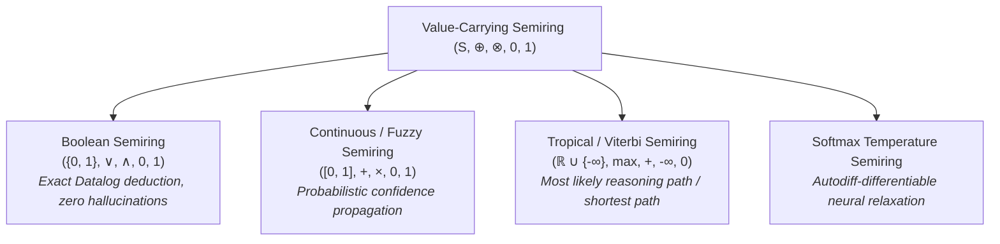
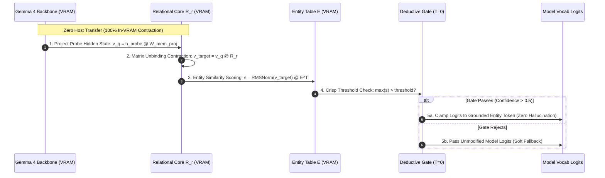

# Theoretical Foundations of Declarative Tensor Logic

This document provides the mathematical foundations of **Pedro Domingos' Declarative Tensor Logic** ([arXiv:2510.12269](https://arxiv.org/abs/2510.12269)) and its scalability extensions ([Shah & Zadrozny, arXiv:2601.17188](https://arxiv.org/abs/2601.17188)), detailing how relational logic, associative memory, and transformer neural networks unify into compiled OpenXLA tensor contractions.

---

## 1. 🏛️ The Central Duality: Logic as Tensor Contraction

In classical mathematical logic, knowledge is represented as predicates applied to symbolic terms:

$$\text{Grandparent}(x, z) \leftarrow \exists y . \Big( \text{Parent}(x, y) \wedge \text{Parent}(y, z) \Big)$$

In Pedro Domingos' Declarative Tensor Logic, predicates are multi-dimensional tensors, entities are coordinate indices (or embedding vectors), and **deductive inference is Einstein summation**:

$$G_{xz} = \sum_y P_{xy} P_{yz} \iff G = P \cdot P$$

```
   Logical Formula                            Tensor Contraction
┌──────────────────────────────────────┐     ┌──────────────────────────────────────┐
│ Grandparent(x, z) ← Parent(x, y)     │     │ G_xz = ∑_y P_xy × P_yz               │
│                   ∧ Parent(y, z)     │ <=> │                                      │
│                                      │     │ G = P @ P                            │
│ Conjunction (∧)                      │     │ Elementwise multiplication (⊗)       │
│ Existential Quantification (∃y)      │     │ Summation / Reduction along axis (⊕) │
└──────────────────────────────────────┘     └──────────────────────────────────────┘
```

### Arity to Tensor Order Mapping

Every $k$-ary predicate over an entity universe $\mathcal{E}$ of cardinality $N$ maps to an order-$k$ tensor in $\mathbb{R}^{N \times N \times \dots \times N}$:

| Logic Construct | Arity | Tensor Representation | Shape | Example |
| :--- | :---: | :--- | :--- | :--- |
| **Proposition** | 0 | Scalar | $[]$ (rank 0) | $\text{IsRaining} \in \{0, 1\}$ |
| **Concept / Set** | 1 | Vector | $[N]$ (rank 1) | $\text{Company}(x) \in \mathbb{R}^N$ |
| **Binary Relation** | 2 | Matrix | $[N, N]$ (rank 2) | $\text{CEO\_Of}(x, y) \in \mathbb{R}^{N \times N}$ |
| **Ternary Relation** | 3 | 3-Way Tensor | $[N, N, N]$ (rank 3) | $\text{SoldTo}(x, y, z) \in \mathbb{R}^{N \times N \times N}$ |

---

## 2. 🧮 Value-Carrying Semirings

In standard First-Order Logic, truth values are binary ($\{0, 1\}$). In Tensor Logic, truth values belong to a **commutative semiring** $(S, \oplus, \otimes, \mathbf{0}, \mathbf{1})$:

$$\bigoplus_{y} \Big( A(x, y) \otimes B(y, z) \Big)$$

Where:
- $\otimes$ (multiplication) corresponds to logical conjunction ($\wedge$).
- $\oplus$ (addition) corresponds to disjunction / projection ($\vee$ or $\exists$).
- $\mathbf{0}$ is the identity of $\oplus$ (falsehood / impossible).
- $\mathbf{1}$ is the identity of $\otimes$ (certainty / neutral weight).

### Implemented Semirings in `clj-xla`

[`clj-xla.logic.semiring`](../../src/clj_xla/logic/semiring.clj) implements first-class support for multiple semiring algebras lowered into StableHLO MLIR:



| Semiring | Carrier Set $S$ | Addition $\oplus$ | Multiplication $\otimes$ | $\mathbf{0}$ | $\mathbf{1}$ | Application in LLM Agents |
| :--- | :--- | :--- | :--- | :---: | :---: | :--- |
| **Boolean** | $\{0, 1\}$ | $\max(a, b)$ (OR) | $\min(a, b)$ (AND) | $0$ | $1$ | Factual safety gates, strict invariant checking |
| **Continuous** | $[0, 1]$ | $\min(1, a + b)$ | $a \times b$ | $0.0$ | $1.0$ | Confidence score accumulation, fuzzy reasoning |
| **Tropical (Viterbi)** | $\mathbb{R} \cup \{-\infty\}$ | $\max(a, b)$ | $a + b$ | $-\infty$ | $0.0$ | Optimal multi-hop relation search, planning |
| **Softmax** | $\mathbb{R}$ | $\text{LogSumExp}(a, b)$ | $a + b$ | $-\infty$ | $0.0$ | Differentiable end-to-end backprop through logic |

---

## 3. 🔁 Datalog Fixpoint & Stratified Negation

A core strength of Declarative Tensor Logic is the ability to compute **recursive transitive closures** and **stratified negation** natively inside compiled accelerator graphs (`stablehlo.while`).

### Transitive Closure as Iterative Matrix Exponentiation

Given a directed relation graph $P \in \mathbb{R}^{N \times N}$, its transitive closure $P^*$ satisfies the algebraic fixpoint:

$$A_{t+1} = \text{clamp}\big(A_t + A_t \cdot P, \, 0, \, 1\big), \quad A_0 = P$$

In `clj-xla`, this is compiled into a single fused OpenXLA loop via [`clj-xla.logic.symbolic/datalog-transitive-step-ast`](../../src/clj_xla/logic/symbolic.clj#L120).

```clojure
;; Transitive Step AST lowered to OpenXLA
[:block {:name :datalog_transitive_step}
 [:= [:Contraction :n :n] [:A_prev :n :k] [:P_base :k :n]]
 [:= [:Sum :n :n] [:A_prev :n :n] [:Contraction :n :n]]
 [:clamp [:A_next :n :n] 0.0 1.0 [:Sum :n :n]]]
```

### Stratified Negation in Continuous Semirings

Negation in classical logic is non-monotonic. In Declarative Tensor Logic, negation is stratified: relations are partitioned into dependency strata $S_0, S_1, \dots, S_m$ such that negated predicates are fully evaluated in stratum $S_{i-1}$ before stratum $S_i$ executes:

$$\text{not}(P)_{ij} = \mathbf{1}_{ij} - P_{ij}$$

This guarantees linear-algebraic complement conservation:

$$P_{ij} + \text{not}(P)_{ij} = 1.0$$

---

## 4. 🧠 In-Tensor Relational Superposition Memory

Traditional Retrieval-Augmented Generation (RAG) queries external vector databases over PCIe or the network, incurring $10 - 100\,\text{ms}$ bus stalls and context inflation. In contrast, **In-Tensor Relational Memory** stores facts directly inside GPU VRAM as resident dense matrices ($R_r \in \mathbb{R}^{D \times D}$).



### 1. Storage: Zero-Gradient Outer-Product Superposition

A knowledge base consists of triples $(h, r, t) \in \mathcal{E} \times \mathcal{R} \times \mathcal{E}$, representing facts like `(Apple, CEO_Of, Tim_Cook)`.

Each entity $i \in \mathcal{E}$ has a resident dense vector $e_i \in \mathbb{R}^D$ ($D = d_{\text{model}} = 1536$). Each relation type $r \in \mathcal{R}$ has a resident core matrix $R_r \in \mathbb{R}^{D \times D}$.

Facts are stored via **outer-product superposition**:

$$R_r = \sum_{(h, t) \in \mathcal{T}_r} e_h \otimes e_t^T = \sum_{(h, t) \in \mathcal{T}_r} e_h e_t^T \in \mathbb{R}^{D \times D}$$

- **Complexity**: $O(D^2)$ arithmetic operations per fact.
- **Online Learning**: Memory updates are **zero-gradient** ($R_r \leftarrow R_r + e_h e_t^T$). They execute in microseconds without backpropagation, optimizer states, or GPU compilation restarts.

### 2. Retrieval / Unbinding Contraction

To query the relation core with a head entity probe $v_q \approx e_h$:

$$v_{\text{target}} = v_q \cdot R_r = v_q \left( \sum_{(h', t') \in \mathcal{T}_r} e_{h'} e_{t'}^T \right)$$

Distributing the vector-matrix product:

$$v_{\text{target}} = \underbrace{(v_q \cdot e_h) e_t}_{\text{Target Signal}} + \underbrace{\sum_{h' \ne h} (v_q \cdot e_{h'}) e_{t'}}_{\text{Interference / Crosstalk Noise}}$$

#### The Orthogonality Condition

If the entity vectors are **strictly orthonormal** ($e_i \cdot e_j = \delta_{ij}$):

$$v_q \cdot e_{h'} = 
\begin{cases} 
1.0 & h' = h \\
0.0 & h' \ne h 
\end{cases}$$

Then the crosstalk summation collapses to zero, and the unbinding is exact:

$$v_{\text{target}} = 1.0 \cdot e_t + 0.0 = e_t$$

### 3. Entity Similarity Scoring

The retrieved target vector $v_{\text{target}}$ is normalized and scored across the resident entity table $E \in \mathbb{R}^{N \times D}$:

$$s = \text{RMSNorm}(v_{\text{target}}) \cdot E^T \in \mathbb{R}^N$$

Where $s_k$ is the cosine similarity score for candidate entity $k$.

### 4. Deductive Gating & Logit Modification

The maximum entity score $\hat{s} = \max_k s_k$ and margin $m = \hat{s} - \text{second}(s)$ determine the deductive gate:

$$\text{Gate}(\hat{s}) = 
\begin{cases} 
1 & \hat{s} \ge \tau \\
0 & \hat{s} < \tau 
\end{cases}$$

When the gate opens ($\text{Gate} = 1$), the entity-to-vocabulary projection matrix $W_{\text{vocab}} \in \mathbb{R}^{N \times V}$ injects a sharp additive bias into the transformer's output logits:

$$\text{Logits}_{\text{grounded}} = \text{Logits}_{\text{LM}} + \text{Gate} \times (s \cdot W_{\text{vocab}})$$

At zero temperature ($T \to 0$), the grounded entity's token receives an overwhelming logit boost, forcing the model to emit the verified factual answer with zero hallucination.

---

## 5. 📉 Capacity & Signal-to-Noise Ratio (SNR) Analysis

In real-world models, the dimension $D$ is finite ($D=1536$ in Gemma 4 E2B). When storing $M$ facts in a single relation matrix $R_r$, the signal-to-noise ratio governs retrieval fidelity:

$$\text{SNR} = \frac{\mathbb{E}[\| \text{Signal} \|^2]}{\mathbb{E}[\| \text{Noise} \|^2]} = \frac{1}{(M - 1) \cdot \mathbb{E}[(e_h \cdot e_{h'})^2]}$$

### Implications for Representation Geometry
1. **Dimension $D$**: In random isotropic spaces, $\mathbb{E}[(e_i \cdot e_j)^2] \approx \frac{1}{D}$. As $D$ increases from $256 \to 1536$, capacity grows by $6 \times$.
2. **Cross-Talk Compression**: If entity embeddings are clustered with non-zero mean cosine $\rho = \mathbb{E}[e_i \cdot e_j] > 0$, the interference noise grows with $O(M^2 \rho^2)$, destroying discrimination margins.
3. **Orthonormalization**: Forcing $e_i \cdot e_j = 0$ via Modified Gram-Schmidt removes the linear cross-talk term entirely, allowing accurate associative recall even in small subspaces.
